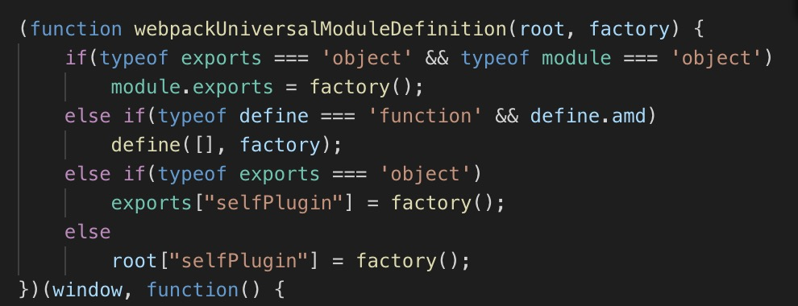

<!--  这只是一份学习webpack的记录，版本4.0 -->

主要是针对 output 中 library 和 libraryTarget 做一份详细说明。
——————

如果你想要编写一个 library,并打算将其发布为单独的文件，请使用此选项

- output.library 配置导出库的名称
- output.libraryTarget 配置以何种方式导出库。

假设我们配置 output.library=‘selfPlugin’,针对 libraryTarget 的配置有以下几种情况：

1、var(默认)

编写的库将通过 var 被赋值给通过 library 指定名称的变量。
//webpack 输出代码
var selfPlugin = lb_code;
//使用库的方法
selfPlugin.doSomething();

其中，lb_code 是指导出库的代码内容，是有返回值的一个自执行函数

2、this
导出的代码将作为 this 的一个属性。
//webpack 输出
this['selfPlugin] = lb_code;
//使用库的方法
this.selfPlugin.doSomethinf();

3、commonjs
编写的库通过 CommonJS 规范导出。
//webpack 输出
exports['selfPlugin] = lb_code;
//使用法法
require('library-name-in-npm')['selfPlugin].doSomething();

4、commonjs2
编写的库通过 CommonJS2 规范导出
//webpack 输出
module.exports = lb_code;
//使用方法
require('library-name-in-npm').doSomething();
import selfPlugin from 'library-name-in-npm'

5、amd
编写的库通过 AMD 规范导出
//webpack 输出

```
define('selfPlugin',[],function(){
return lb_code
})
```

//使用方法

```
require([selfPlugin],function(){
...//处理逻辑
})

```

6、umd
这个厉害了。导出代码遵循 umd 规范。如果想了解 umd 规范，自行百度。
//webpack 输出

//使用方法
都可以
